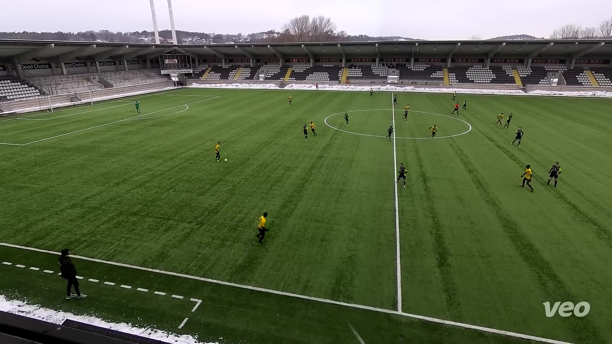
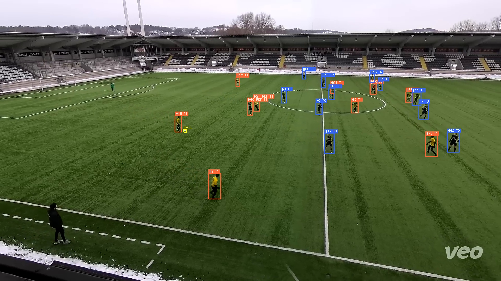
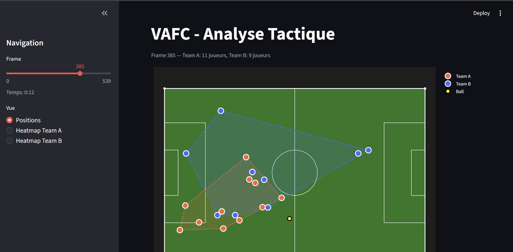
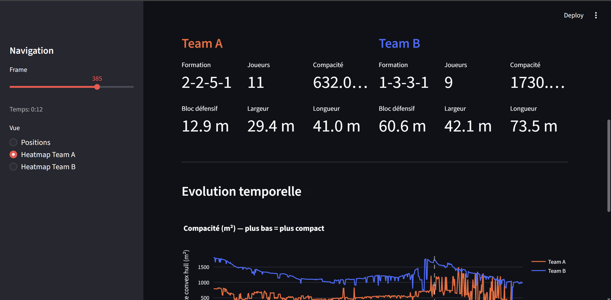
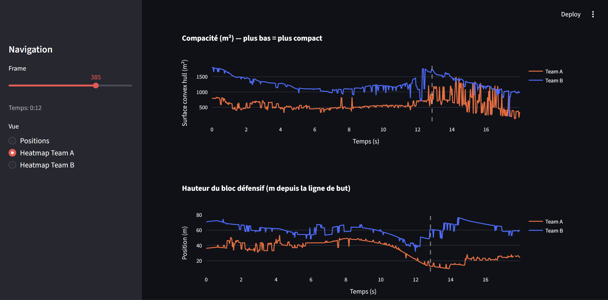
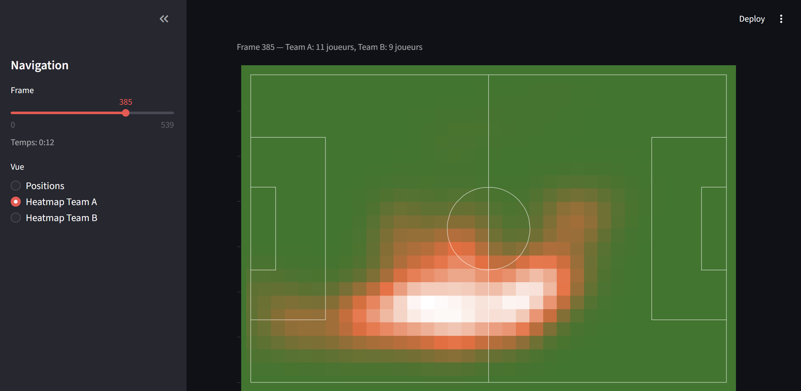

# FootVision AI

Outil d'analyse tactique automatisée pour le football, concu pour les analystes de clubs semi-pro et professionnels. A partir d'une simple video Veo (camera autonome), FootVision genere automatiquement des donnees tactiques exploitables : positions des joueurs, formations, compacite, hauteur du bloc defensif, heatmaps.

## Objectif

Les clubs de Ligue 2, National et semi-pro investissent dans des cameras Veo pour filmer leurs matchs, mais l'analyse reste largement manuelle et chronophage. FootVision automatise cette analyse en transformant une video Veo brute en donnees tactiques structurees.

**Cas d'usage :**
- Preparer un match en analysant le schema tactique de l'adversaire
- Debriefer un match avec des metriques objectives (compacite, pressing, bloc)
- Comparer les formations et les zones d'occupation entre deux mi-temps
- Identifier les tendances sur plusieurs matchs

## Pipeline

```
Video Veo (.mp4)
    |
    v
[Step 1] Detection + Tracking (YOLOv8 + ByteTrack)
    |    - Detection des joueurs, gardiens, arbitres
    |    - Suivi frame par frame
    |    - Separation des equipes par couleur de maillot (K-means)
    v
[Step 2] Homographie (OpenCV)
    |    - Projection des positions pixel -> coordonnees terrain (metres)
    |    - Calibration automatique par optimisation
    v
[Step 3] Metriques tactiques + Dashboard (Streamlit)
         - Formations (4-3-3, 4-4-2, etc.)
         - Compacite (surface convex hull)
         - Hauteur du bloc defensif
         - Heatmaps par equipe
         - Graphiques d'evolution temporelle
```

## Screenshots

### Frame Veo originale


### Detection des joueurs + separation des equipes


### Dashboard — Vue tactique 2D avec convex hull


### Dashboard — Formations et metriques d'equipe


### Dashboard — Evolution temporelle (compacite + bloc defensif)


### Dashboard — Heatmap d'equipe


## Features implementees

- [x] Detection des joueurs, gardiens et arbitres (YOLOv8 pre-entraine football)
- [x] Detection du ballon (modele YOLO dedie)
- [x] Tracking multi-objets (ByteTrack)
- [x] Separation automatique des equipes par couleur de maillot (K-means sur HSV)
- [x] Deduplication des detections (NMS cross-classes)
- [x] Homographie camera -> terrain 2D (optimisation automatique)
- [x] Projection des positions joueurs en coordonnees reelles (metres)
- [x] Detection de formation (4-3-3, 5-2-2-1, etc.)
- [x] Compacite d'equipe (surface du convex hull)
- [x] Hauteur du bloc defensif (position moyenne des 4 defenseurs)
- [x] Largeur et longueur d'equipe
- [x] Heatmaps par equipe
- [x] Dashboard interactif Streamlit avec slider temporel
- [x] Graphiques d'evolution temporelle (compacite, bloc)
- [x] Generation de cas de verification (original + detection + 2D)

## Stack technique

| Composant | Technologie |
|---|---|
| Detection joueurs | [YOLOv8](https://github.com/ultralytics/ultralytics) (modele `uisikdag/yolo-v8-football-players-detection`) |
| Detection ballon | [YOLO11](https://huggingface.co/martinjolif/yolo-football-ball-detection) |
| Tracking | ByteTrack (integre Ultralytics) |
| Separation equipes | K-means (scikit-learn) sur espace HSV |
| Homographie | OpenCV + SciPy (optimisation) |
| Metriques | NumPy, SciPy (ConvexHull, gaussian_filter) |
| Dashboard | Streamlit + Plotly |
| Langage | Python 3.11+ |

## Structure du projet

```
TrimFootball/
├── README.md
├── video2.mp4                  # Video Veo source (1080p)
├── tracking_data.json          # Donnees de tracking (positions, equipes, pitch coords)
├── generate_case.py            # Generer un cas de verification
├── models/                     # Modeles YOLO telecharges depuis HuggingFace
│   ├── players_detection/
│   └── ball_detection/
├── step1_tracking/             # Detection + tracking + separation equipes
│   ├── step1_tracking.py
│   └── custom_bytetrack.yaml
├── step2_homography/           # Calibration camera -> terrain 2D
│   ├── step2_homography.py
│   └── homography.npy
├── step3_metrics/              # Dashboard tactique Streamlit
│   └── app.py
├── docs/                       # Images pour le README
└── cas1/                       # Exemple de cas de verification
    ├── 1_original.jpg
    ├── 2_detection.jpg
    └── 3_pitch_2d.jpg
```

## Lancement rapide

```bash
# 1. Installer les dependances
pip install ultralytics opencv-python scikit-learn scipy streamlit plotly huggingface_hub

# 2. Telecharger les modeles (automatique au premier lancement)
python step1_tracking/step1_tracking.py

# 3. Calculer l'homographie
python step2_homography/step2_homography.py

# 4. Lancer le dashboard
cd step3_metrics && streamlit run app.py
```

## Limites connues (MVP)

- **ID switching** : le tracker perd et re-acquiert les joueurs (88 IDs au lieu de ~24 sur 18 sec). N'impacte pas les metriques agregees mais empeche le suivi individuel.
- **Homographie approximative** : calibration automatique ~80% precise. Un calibrage interactif (clic sur 4 points) ameliorerait la precision.
- **Ballon** : detecte sur ~50% des frames. Suffisant pour le MVP, ameliorable avec fine-tuning.
- **Joueurs eloignes** : les joueurs au fond du terrain (~20px) sont parfois non detectes.

## Prochaines etapes

- [ ] Calibrage interactif de l'homographie (clic sur les points du terrain)
- [ ] Re-identification des joueurs (ReID) pour stabiliser le tracking
- [ ] Detection de la possession (equipe la plus proche du ballon)
- [ ] Analyse du pressing (vitesse + direction vers le ballon)
- [ ] Export PDF/rapport automatique pour le staff technique
- [ ] Support multi-video (analyser plusieurs matchs)
